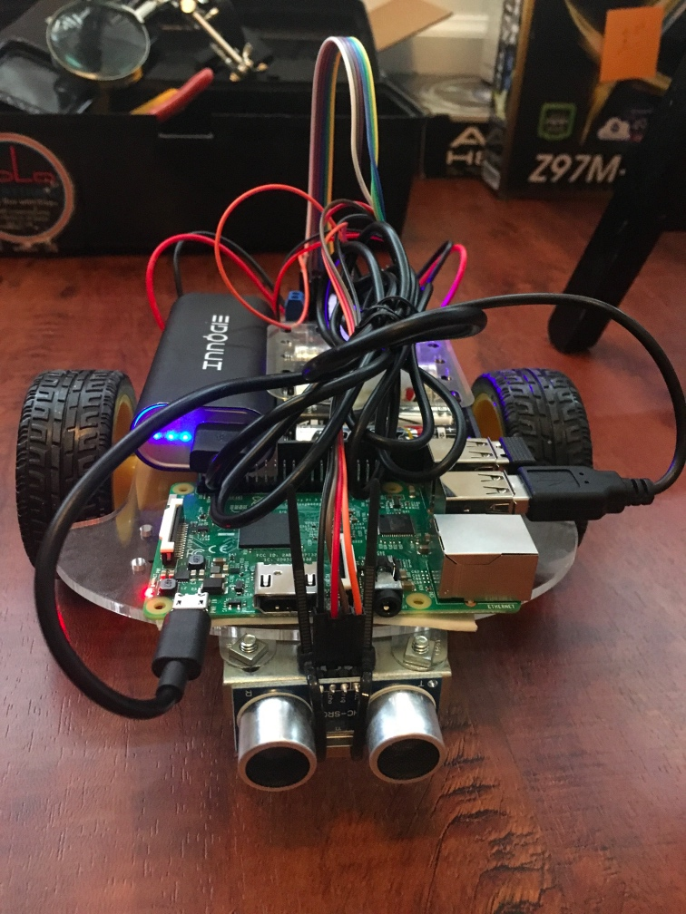

# Small arduino based robot


 

### parts
* chassis and motors: [amazon](https://www.amazon.com/gp/product/B01BXPETQG/ref=oh_aui_search_detailpage?ie=UTF8&psc=1)

* motor controller: [L298N](https://www.amazon.com/gp/product/B014KMHSW6/ref=oh_aui_search_detailpage?ie=UTF8&psc=1)

* Arduino nano
* Raspberry pi 3
* usb battery pack
* ultrasonic sensor [amazon](https://www.amazon.com/gp/product/B004U8TOE6/ref=oh_aui_search_detailpage?ie=UTF8&psc=1)

### Design 
I wanted the electronics to be isolated from whichever computer was doing the logic and sensing. Rather than drive the motor controller directly from the raspbery pi, I used an arduino with a serial USB interface to handle the electronics. My thought process at the time was to be able to plut in any computer ranging from the pi to a laptop or the Jetson TK1 I have laying around. 

The arduino talks to the pi by sending controll packets over serial. This packet includes the speed and direction to set the left and right wheels.

on the arduino:

```cpp
struct __attribute__ ((packed)) motorPacket {
  bool left_positive;
  uint8_t speed_left;
  bool right_positive;
  uint8_t speed_right;
};
```
and on the raspberry pi (python)

```python
motor_packet = pack('>c?B?B','M',d_left,s_left,d_right,s_right)
```

### To Fix:
There is no testing for lost packets or proper buffering for changes in processing speed on either the arduino or host computer side. Additionally the robot would often drive in circles as there was no feedback between the intended instruction and the actual. The right motor was a little slower and tended to push the robot in circles if driven at the same rate as the left motor. A better design would measure how far the wheels moved and adjust the drive rates accordingly.


